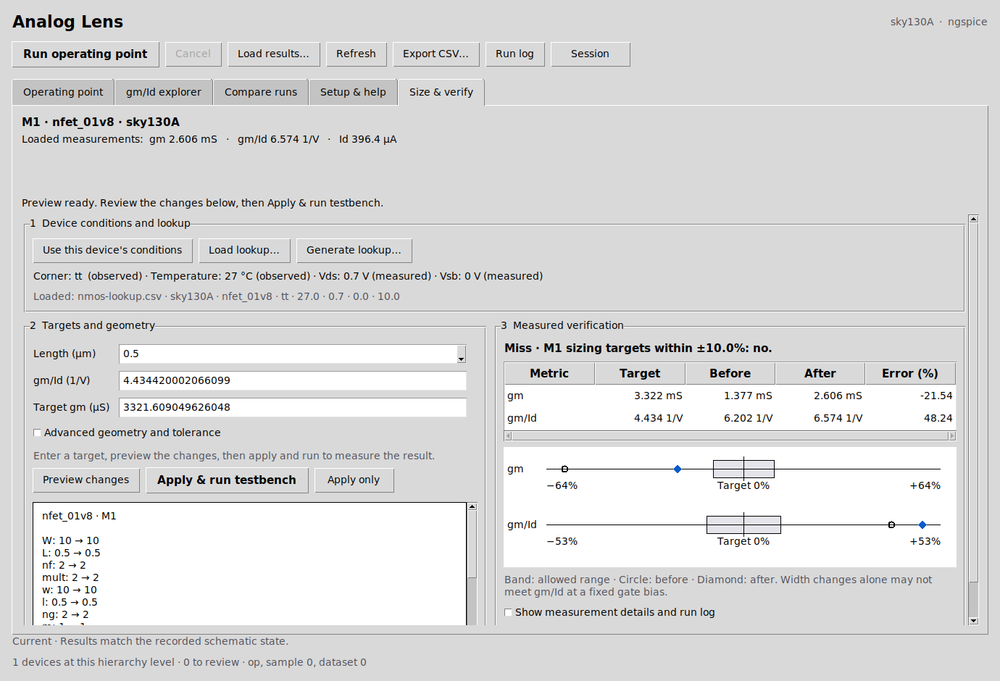
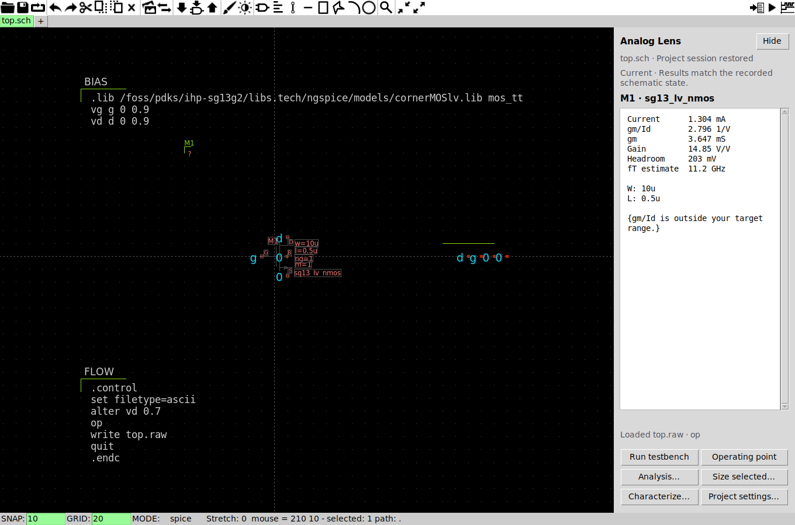
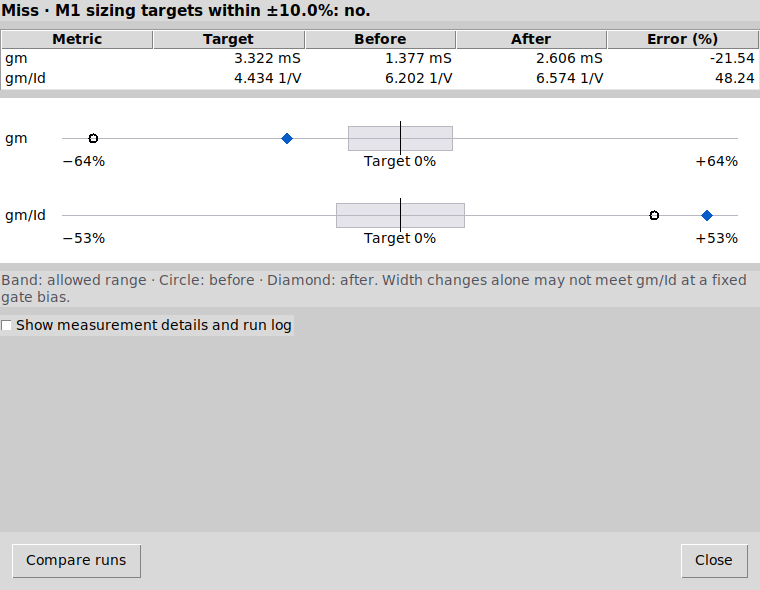
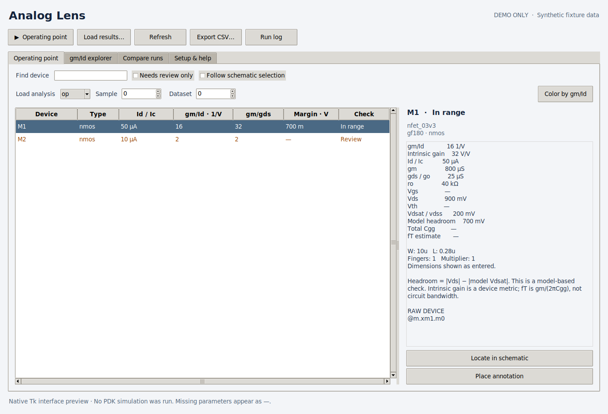
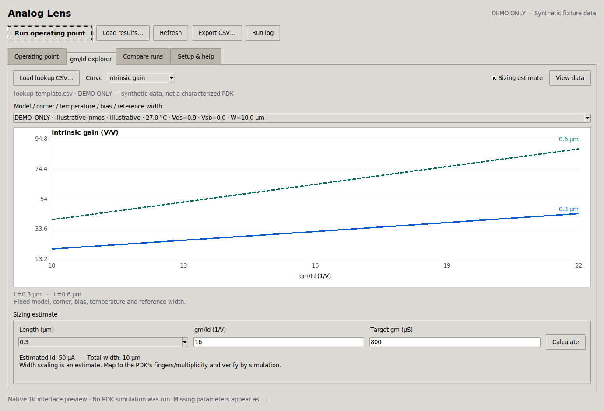

# Analog Lens for xschem

New in v0.6: a unified **Size & verify** workspace, device-condition reuse, actionable recovery, optional project setup, visual verification, flexible units and installed corner choices. See the [usability guide](docs/USABILITY_V06.md).

A native Tcl/Tk analysis extension. It adds an **Analog Lens** menu, inspector sidebar and resizable analysis window inside xschem's process. No browser, server, account, or Python service is required. PDK characterization uses a short-lived Python command and ngspice.

Version **0.6.1** targets **IIC-OSIC-TOOLS on Linux/X11**, including its VNC desktop. The host operating system can run the IIC container; native macOS/Windows GUI support is outside this project's scope.

The **inspector sidebar** connects normal xschem simulations, per-testbench autosave, waveform cursor B, sizing previews with Undo, and real PDK lookup generation. The [usability guide](docs/USABILITY_V06.md) explains the guided workspace; the [integration guide](docs/INTEGRATION_V05.md) covers project history and characterization batches.

**Validated in IIC 2026.08:** 125 tests, the native Tk smoke test, 24 direct model simulations, and all four real PDK GUI workflows pass. The [passing IIC run](https://github.com/jonahsaunders/analog-lens/actions/runs/35767855614) includes the unified workspace, condition reuse, optional setup, unit inputs, installed corner choices, visual verification and batch cache reuse. [VALIDATION.md](VALIDATION.md) records the exact image, models and evidence.

**v0.6.1 GUI audit:** improved short-window layouts, larger-text tables, dialog keyboard controls, field validation and progress feedback. [Apple HIG audit and screenshots](docs/GUI_AUDIT_061.md).

## Interface preview



**Size & verify.** Targets, inline geometry preview and measured verification in one workspace. This and [characterization with condition reuse](docs/images/iic-hig-characterization.png) show the v0.6.1 real IIC run. The [optional project setup](docs/images/iic-project-setup.png) capture documents v0.6.



**Integrated inspector.** An earlier validated IIC capture using the installed IHP SG13G2 model. The [sizing preview](docs/images/iic-sizing-preview.png) shows the geometry Apply and Undo workflow.



**Measured sizing verification.** A real target miss is reported with before/after values and signed errors. [Project results](docs/images/iic-project-results.png) retains runs and named baselines; [characterization batches](docs/images/iic-characterization-batch.png) reuse completed, verified conditions.



**Operating-point inspector.** Browse device results, spot devices needing review, and inspect the selected transistor. This is a native Tk capture using the repository's synthetic test fixture, not measured PDK results. Missing parameters remain `—`.

See the [gm/Id explorer preview](#gmid-explorer) below. [Screenshot sources and regeneration instructions](docs/images/README.md) are included.

The inspector and help text scroll, numeric columns sort in both directions, and search filters have a clear empty state. **Run log** updates while ngspice runs. **View data** in the explorer opens a copyable table of lookup values. The extension keeps the host's ttk theme and uses its system fonts; it does not change xschem's global theme.

| Action | IIC shortcut |
|---|---|
| Find a device | Ctrl+F |
| Load results | Ctrl+O |
| Refresh | Ctrl+R |
| Run operating point | Ctrl+Shift+R |
| Export CSV | Ctrl+Shift+S |
| Switch tabs | Ctrl+1–5 |
| Close Analog Lens | Ctrl+W |
| Inspect chart samples | Left / Right while chart has focus |
| Zoom / reset chart | + / − / Home while chart has focus |

Shortcuts apply within the extension window. Use Tab / Shift+Tab to move between controls. The **Sort** menu provides keyboard sorting, and **View data** provides a numeric chart alternative.

## Install in IIC-OSIC-TOOLS

Extract this folder into your mounted designs directory. In the IIC terminal, run:

```sh
python3 /foss/designs/xschem-analog-lens/install.py --rc /foss/designs/YOUR_PROJECT/xschemrc
```

Replace `YOUR_PROJECT` with your existing project. The installer preserves the PDK setup, backs up `xschemrc`, and adds one source statement. Restart xschem; the inspector sidebar opens beside the schematic. Use **Analog Lens → Open analysis window** for the larger tables and charts.

For a persistent installation in a mounted directory, add:

```sh
--destination /foss/designs/plugins/analog-lens
```

The default destination is `~/.xschem/analog-lens`. This may be lost if your container home directory is not persisted. Projects with their own `xschemrc` must include the extension themselves; a user-level configuration is not always read when a project-level file exists.

To try it without editing any configuration, enter these lines in the xschem Tcl console:

```tcl
source /foss/designs/xschem-analog-lens/analog_lens.tcl
::analog_lens::show
```

Requirements: xschem with Tcl/Tk 8.6 or newer and the documented `xschem raw` API; ngspice on PATH; a working project PDK/model configuration. IHP requires the usual OSDI/PSP setup. The extension never edits installed PDK files. Load it **after** the PDK's xschemrc.

## Integrated workflow

1. Open a saved testbench. Its targets, baselines and lookup choices restore automatically.
2. Select a transistor to inspect it in the sidebar.
3. Use **Run testbench**, or xschem’s normal Netlist/Simulate controls. Your `.control` commands stay intact; the extension attaches new raw results when the run succeeds.
4. Open **Project settings…** to choose a result file/plot or follow waveform cursor B.
5. Use **Characterize…** for measured lookup curves and **Size selected…** to open the unified workspace. **Use this device’s conditions** fills known characterization inputs and finds compatible saved lookup data.
6. Use **Size & verify** to keep targets, inline preview and measured target errors together. Use **Project results** to reopen archived runs, compare named baselines, or start a reusable PVT/bias batch.

[Complete workflow, settings and limits](docs/INTEGRATION_V05.md).

## Everyday workflow

1. Open your top-level simulation testbench in xschem.
2. Click **Run operating point**. The extension discovers devices from a generated netlist without navigating the editor, generates parameter saves, and runs ngspice asynchronously. It preserves source schematics and existing simulation blocks.
3. Descend into the circuit. The table follows the current hierarchy. Select a transistor in xschem or the table to see its operating point and derived metrics.
4. Use **Locate in schematic** for cross-probing, or **Color by gm/Id** to highlight devices below, within, or above your targets using xschem palette layers 8, 4, and 6. This adds highlights; use xschem's Highlight menu to clear them. **Place annotation** places an optional annotation symbol; click in the schematic to position it. This is the only analysis action that intentionally adds a schematic object.
5. **Keep baseline**, edit the circuit, rerun, and inspect **Compare runs**. Export CSV to retain a report.

The inspector displays Id/Ic, gm, gds/go, gm/Id, intrinsic gain, ro, Vgs, Vds, model Vth/Vdsat, model headroom, Cgg, and estimated fT when the required vectors exist. Missing results are `—`; they are never silently replaced with zero. Width, length, finger count, and multiplier are shown as entered, without guessing units or double-counting multiplicity.

The device list is scoped to the currently open hierarchy level. To see transistors in a subcircuit, descend into that subcircuit. The OP run gathers saves from generated and included SPICE subcircuit definitions without changing the displayed sheet. Recursive, unresolved or conditional design topology is rejected explicitly. Encrypted models, unsupported primitive wrappers and multi-device composite models may require an adapter or a separately generated raw file.

### Save work and compare runs

Enter a name in **Compare runs**, then click **Keep baseline**. Each baseline retains its device results, hierarchy, and provenance; duplicate names receive a suffix. Choose an earlier baseline from the selector. Comparisons show matched, added, and removed devices, with gm/Id, gain, current, headroom, and estimated fT values and changes. **Export comparison…** includes stored numeric values and metadata, without the table's display rounding. Source precision is limited by xschem's raw-data reader and numeric API.

Use **Session → Save session…** to save an `.alsession` file in your mounted designs directory. It stores named baselines, targets, lookup-file selection, sizing inputs, sorting, and window/pane size. **Open session…** restores it. Load or run current results separately. Lookup data is referenced by path; if that file has moved, load it again. Session files are parsed as data, never executed. The active saved testbench also autosaves its working session under the project’s `.analog-lens/sessions/` folder. Explicit session files remain useful for sharing or moving work.

**Setup & help → Result conditions** records optional corner, temperature, Vds, and Vsb values for comparisons and chart overlays. These are user-declared and do not change the simulator. Observed deck conditions take precedence when unambiguous; device bias checks use measured external terminals. Unknown conditions remain unverified, dependency gaps are marked partial, and mismatched lookup overlays are hidden. A single declared bias describes the intended comparison condition, not every transistor's measured terminal voltage.

### Run control and setup checks

**Cancel** sends a stop request only to the ngspice process started by this extension. If it is still running after two seconds, the extension terminates that same process, checking its Linux process identity first. Partial results are never loaded after cancellation. Previous loaded results stay available. Closing the window lets the run continue; reopen Analog Lens to inspect or cancel it.

Elapsed time and the live run log remain available during simulation. **Session → Check environment** checks ngspice, the PDK/init paths, the simulation directory, the testbench, and xschem's results API. These checks diagnose setup; the integration harness below verifies real simulation behavior.

### Existing simulation flows

You can use **Load results…** with `op`, `dc`, or `tran`. Set **Sample** and **Dataset** to select a saved point (zero-based). Enable **Follow waveform cursor B** in Project settings to select the nearest saved DC/transient point automatically. The extension does not interpolate between samples. Load a top-level raw file at the top level, then descend, so xschem's raw hierarchy mapping is correct.

**Operating point** intentionally replaces top-level `.control` blocks and top-level analyses in its disposable netlist. It retains models, includes, sources, and `.param` statements. If your bias/model setup relies on `alter`, `alterparam`, `pre_osdi`, `set`, or other commands inside `.control`, use your own simulation and **Load results**, or move that required setup into the normal model/environment setup. Included files with their own control blocks are not rewritten. Run logs and generated decks stay in xschem's simulation directory.

Changing tabs or hierarchy while ngspice runs will not load results into the wrong schematic; the status bar tells you which raw file to load after returning to the testbench.

## gm/Id explorer



**gm/Id explorer.** Native Tk capture using `examples/lookup-template.csv`, labeled `DEMO_ONLY`. The curves and sizing estimate are illustrative synthetic data, not a characterized PDK.

Load measured CSV lookup data. It groups by PDK, model, corner, temperature, Vds, Vsb, and total reference width. Within that fixed slice, each channel length is a separate curve. Select PDK, model, corner, temperature, Vds, Vsb, and reference width separately. Choose **All** lengths or one length. Plot intrinsic gain, estimated fT, or current density against gm/Id. Click sample markers or use Left/Right to inspect values; use the zoom controls and **Reset view**. **Export SVG…** saves the current chart view with source/condition metadata. When a matching model is selected in the inspector, its actual gain/fT operating point can appear as a dot; verify the circuit's corner, temperature and bias yourself.

Required columns:

| Column | Meaning |
|---|---|
| `pdk`, `model`, `corner` | Explicit process and device provenance |
| `temp_c` | Temperature in degrees Celsius |
| `vds_v`, `vsb_v` | Device bias in volts, using your table's declared sign convention |
| `length_um` | Channel length in micrometers |
| `total_width_um` | Total reference width, including parallel multiplicity |
| `id_a`, `gm_s`, `gds_s` | Saved current and small-signal parameters in SI units |
| `cgg_total_f` | Optional total gate capacitance in farads, including relevant overlaps |

The file in `examples/lookup-template.csv` is **illustrative synthetic data**, explicitly labeled `DEMO_ONLY`. It is a format example, not a characterized PDK or a valid sizing database. Replace it with your characterization data.

Enable **Sizing estimate** to reveal the sizing form. In compact windows it replaces the chart area; hide it to return to the chart. **View data** remains available. Sizing interpolates current density within a selected curve, computes `Id = gm / (gm/Id)`, then estimates total width from `Id / current_density`. Extrapolation, duplicate gm/Id samples, and unordered/multiple branches are rejected. Supply each curve in monotonic sweep order. Editing an input clears the previous estimate; invalid entries explain the problem next to the form. Linear width scaling is an estimate; map the result to the PDK's width/finger/multiplier convention and resimulate. **Preview schematic changes…** lists proposed edits before Apply; one xschem Undo restores them. Finger and copy controls preserve existing counts by default, enforce supported geometry limits, and feed the measured sizing verification workflow. **Characterize…** generates real lookup data from supported installed PDK models. See the [v0.5 workflow guide](docs/INTEGRATION_V05.md) for compatible conditions, geometry, verification, project history and PVT/bias batches.

### Import existing MAT lookup data

An optional converter accepts flat or structured Murmann/pygmid-style `.mat` files with `L`, `VGS`, `VDS`, `VSB`, `ID`, `GM`, and `GDS` arrays in **L, VGS, VDS, VSB** order:

```sh
python3 tools/convert_mat.py nch.mat nch.csv \
  --variable nch --pdk sky130A --model nfet_01v8 \
  --corner tt --temp-c 27 --total-width-um 10 --length-unit um
```

Omit `--variable` for flat MAT fields. Add `--cgg-is-total` only if `CGG` already includes the relevant overlap capacitances. The converter requires NumPy/SciPy; the extension itself does not. MAT v7.3/HDF5 and pickle files are not supported.

## Interpretation

- gm/Id and intrinsic gain are positive magnitudes; current and terminal voltages retain simulator signs.
- Headroom is `abs(Vds) - abs(model Vdsat)` (PSP `vdss`). It is a model-based bias check, not a universal saturation test.
- IHP PSP effective Cgg is `cgg + cgsol + cgdol`. fT stays unavailable if either overlap value is missing. BSIM uses saved instance `cgg` directly.
- `gm/(2πCgg)` is an approximate device fT; it is not measured circuit bandwidth.
- gm/gds is intrinsic transistor gain; it is not loaded stage or loop gain.
- gm/Id target limits are editable design checks, not universal weak/moderate/strong inversion boundaries.
- AC gain, stability, noise, transient settling, Monte Carlo, and automatic circuit optimization are not implemented. Characterization covers the documented MOS profiles and fixed-bias gate sweeps.

## Tests

```sh
python3 -m unittest discover -s tests -v
```

These tests execute the real Tcl numerical/adapter logic through Python's Tcl interpreter, with fixture xschem commands for integration contracts. They do not substitute for PDK simulation validation.

The native GUI interaction tests skip without an X11 display. To run the complete suite, including keyboard input, sorting, validation, minimum-size layout, and dark-theme checks:

```sh
xvfb-run -a -s '-screen 0 1440x1000x24' python3 tools/run_tests.py --require-gui
```

For the real native Tk widget/event smoke test in an IIC environment with `wish` and `xvfb-run`:

```sh
xvfb-run -a wish tests/gui_smoke.tcl
```

The required test runner fails if native GUI tests are skipped. GitHub Actions also captures previews for review.

For complete validation **inside IIC-OSIC-TOOLS**:

```sh
xvfb-run -a -s '-screen 0 1440x1000x24' python3 tools/validate_iic.py --require-all --output ./iic-validation
```

This runs the native suite, real NMOS/PMOS ngspice checks, and actual xschem GUI checks for top-level and hierarchical circuits, cross-probing, highlighting, annotation placement, and session save. Exported metrics are compared with raw simulator values. Reports retain generated decks, raw data, logs, and the IIC version. `--require-all` fails if any supported PDK is missing.

From a host with Docker (or `CONTAINER_ENGINE=podman`):

```sh
bash tools/run_iic_container.sh
```

The default image is `hpretl/iic-osic-tools:2026.08`; override `ANALOG_LENS_IIC_IMAGE` to test a different tag/digest. The resolved image information and reports are saved under `build/iic`. This downloads a large image; allow at least 20 GB of free disk space. No PDK files are modified.

## Remove

Remove the `BEGIN ANALOG LENS` / `END ANALOG LENS` block from the same `xschemrc`, restart xschem, then delete the installed extension folder if desired. Keep source model configurations and schematics intact.

MIT license. This extension is independent of xschem, IIC-OSIC-TOOLS, and the PDK maintainers.
