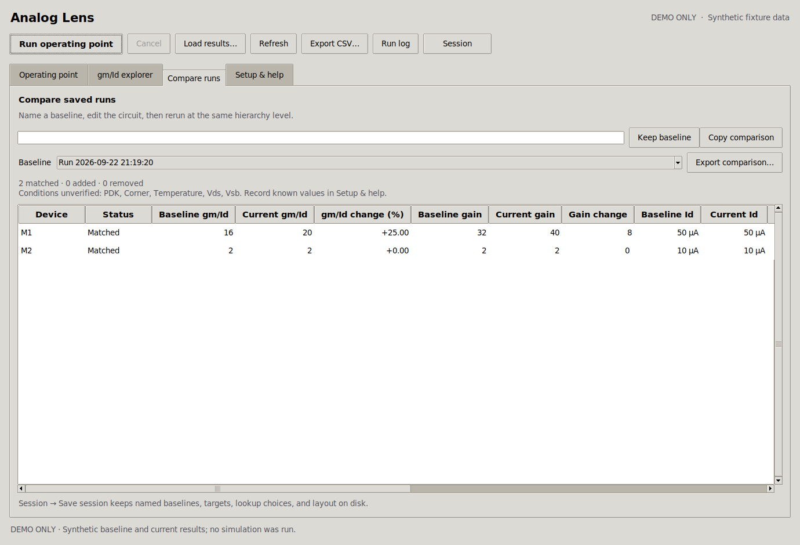
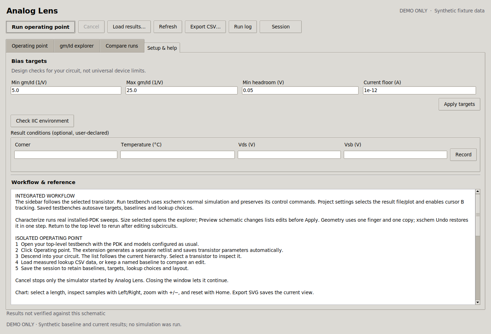
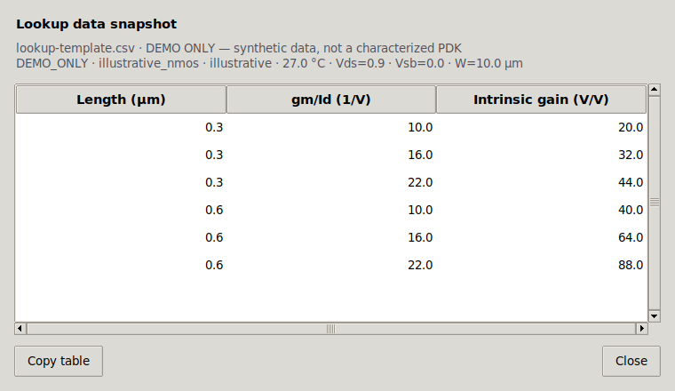
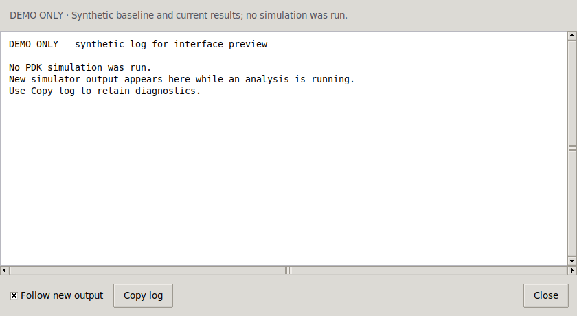

# GUI audit and upgrade

Date: 2026-09-22 · Original audit: 0.2.0 · Current follow-up: 0.4.0

## Scope and interpretation

Reviewed the four tabs, the xschem extension menu, main toolbar, inspector,
chart, lookup-data dialog, run-log dialog, file choosers, warning alerts,
keyboard navigation, and loading/empty/error/busy states. The review used
Apple's current Human Interface Guidelines, with emphasis on desktop use.

Analog Lens is a Tcl/Tk extension inside xschem, targeting IIC-OSIC-TOOLS on Linux/X11. The changes
apply HIG principles to native Tk controls; they do not turn the extension
into an AppKit application or establish full Apple accessibility compliance.
No Apple artwork, platform-only materials, or global replacement theme is used.

## Findings and resolutions

Severity describes the original usability impact: **High** can hide content
or prevent an interaction; **Medium** causes confusion or unnecessary effort.

| Surface | Severity | Finding | Upgrade | HIG reference |
|---|---|---|---|---|
| Typography | Medium | Font tuples treated Tk font names as font families, losing the actual system font. | Named fonts derive from `TkDefaultFont` and `TkFixedFont`; row heights use font metrics. | [Typography][type] |
| Appearance | Medium | Fixed light backgrounds and text colors could conflict with a dark host theme. | App styles derive the background, foreground, and content surface from ttk; supporting text and chart colors have light/dark variants. The host theme is preserved. | [Color][color] |
| Toolbar | Medium | The main action had the same emphasis as utility actions and used a decorative play glyph. | Clear **Run operating point** label, primary emphasis, content-sized buttons, and wrapping at reduced width. | [Buttons][buttons], [Toolbars][toolbar] |
| Navigation | High | Common actions lacked local keyboard shortcuts and documented traversal. | Ctrl shortcuts, notebook traversal, keyboard sorting, Return actions, and searchable-device focus. Bindings stay in the extension window. | [Keyboards][keys] |
| xschem menu | Medium | Several important views/actions were reachable only after opening the window. | Menu entries for all analysis tabs and utility actions; actions share toolbar availability checks. Ellipses remain on file-selection actions. | [Buttons][buttons] |
| Inspector | High | Long metrics and explanatory text were clipped without a scrollbar. | Scrollable, selectable monospace text; copy details; pane bounds protect action labels. | [Layout][layout], [Accessibility][access] |
| Device table | Medium | Numeric columns were not aligned; sorting was ascending-only and lost on refresh. | Right-aligned values, header direction indicators, ascending/descending sorting retained across refresh, missing values last, preserved selection. | [Lists and tables][tables] |
| Search | Medium | Empty filters looked like missing simulation data and could leave stale details. | Counts, distinct recovery messages, Clear action, cleared details and disabled selection actions when no row matches. | [Layout][layout] |
| Run feedback | High | A running process offered little visible feedback beyond status text. | Indeterminate progress and **Running…** action state; incompatible actions are disabled; log output remains available. | [Progress indicators][progress] |
| Alerts and validation | Medium | Routine input errors interrupted work with modal warnings. | Sizing and bias-target errors appear beside the form with field focus/invalid state; failed file/run actions use a parented warning with details. | [Alerts][alerts] |
| Explorer controls | Medium | Internal metric names and a dense form made the primary chart harder to scan. | Descriptive metric labels, source filename/provenance, and an optional **Sizing estimate** section. | [Layout][layout] |
| Chart interpretation | Medium | Curves depended heavily on color and had no in-app numeric alternative. | Direct length labels, different dash patterns, and a **View data** table with units and copy support. If space is insufficient, a message directs people to the table. | [Color][color], [Charts][charts] |
| Sizing | High | An old estimate could remain visible after its inputs changed. | Edits invalidate the old estimate; invalid and out-of-range requests have inline feedback. | [Accessibility][access] |
| Comparison | High | No baseline or a different hierarchy produced an unexplained blank table. | Explicit baseline/mismatch/no-match messages, signed percentage changes, both scrollbars, and a copyable comparison. | [Lists and tables][tables] |
| Setup and help | High | The editable settings followed a large, unscrollable block of reference text. | Targets and validation are grouped first; reference text and keyboard help have a visible scrollbar. | [Layout][layout] |
| Run log | Medium | Opening the log destroyed the previous window, and output was a static snapshot. | Reused transient window, live append, optional tail following, copy/close controls, and preserved reading position when scrolled back. | [Progress indicators][progress] |
| Secondary windows | High | Dialog actions could be squeezed below the visible area at small sizes. | Actions reserve space before expanding tables/text; custom dialogs support Close/Escape and Ctrl+W. File choosers belong to the analysis window. | [Layout][layout] |
| Window lifecycle | Medium | Lookup selectors could lose their option lists after closing and reopening. | Restore slice/length choices and retain one set of callback traces per window. | [Layout][layout] |

## Verification

- **51 tests passed** with Python 3.12 and Tcl/Tk 8.6.14 on Linux under Xvfb:
  38 numerical/adapter/installer/contract tests and 13 native GUI tests.
- The existing native Tk widget/event smoke test also passed.
- Native tests cover sort direction/refresh/selection, missing values, filter
  recovery, atomic target validation, sizing invalidation, numeric lookup
  copying, busy controls, log updates, signed comparison changes, keyboard
  events, reopening, plot-axis geometry, and secondary-dialog layout.
- Action bounds and requested widths were checked at **900×640**, using
  both default fonts and **14-point** system fonts. Tables use horizontal
  scrolling when their columns exceed the available space; inspectors and
  reference text use vertical scrolling.
- Primary, muted, warning, and error text pairs in a representative dark
  host theme meet a **4.5:1** computed contrast ratio. This is not a claim
  about every possible third-party ttk theme or every system-rendered state.
- Rendered previews cover all tabs, custom dialogs, filtered-empty states,
  minimum-size layouts, larger text, and a representative dark host theme.
  Screenshot content uses synthetic fixtures, not PDK simulation results.

Run the complete suite with an X11 display:

```sh
xvfb-run -a -s '-screen 0 1440x1000x24' python3 -m unittest discover -s tests -v
xvfb-run -a wish tests/gui_smoke.tcl
```

## Preview gallery

The inspector and explorer are shown in the main [README](../README.md).
These additional captures document the rest of the interface.

### Compare runs



### Setup and help



### Lookup data



### Run log



## v0.3 IIC workflow follow-up

The supported target is now explicitly **IIC-OSIC-TOOLS on Linux/X11**. Native Mac/Windows validation is outside the requested scope.

Implemented after the original audit:

- Linux cancellation with process identity checks, timed escalation, elapsed time, and preserved prior results.
- Named baselines and versioned `.alsession` files for targets, lookup choices, layout, and comparisons.
- Added/removed device rows and current, headroom, gain, and estimated fT changes, with CSV export.
- User-declared conditions, raw-file/schematic provenance, comparison mismatch notices, and hidden mismatched chart overlays.
- Separate lookup filters, length selection, sample inspection, zoom/reset, and SVG export.
- Environment diagnostics with copyable recovery instructions.
- Required native GUI CI and a separate IIC integration harness/job.

65 local tests and the native smoke test pass. Chart controls and sizing remain accessible at 900×640 and with larger text; compact sizing mode explicitly switches back to the chart when sizing is hidden. See [the current validation record](../VALIDATION.md) for integration evidence and boundaries.

## Original v0.2 validation boundaries (updated status)

| Area | Boundary / follow-up |
|---|---|
| macOS Aqua and VoiceOver | Outside the IIC-only target scope. |
| Live xschem and PDKs | Passed eight real device simulations and four xschem workflows in IIC 2026.08; exact models and evidence are in [VALIDATION.md](../VALIDATION.md). |
| Host theme/font changes | Colors and fonts derive from the active IIC Tk theme when the window opens. Reopen the window after changing those settings. |
| Localization | English labels and units were reviewed. Translations and right-to-left layout have not been implemented or tested. |
| Very long runs | v0.3 adds cancellation and elapsed time for Linux processes. Progress remains indeterminate. Closing the window lets the run continue. |

## Apple sources

Guidance retrieved on 2026-09-22. The desktop and cross-platform principles
were applied; touch-only dimensions and Apple-only rendering effects were
not treated as Tcl/Tk requirements.

[layout]: https://developer.apple.com/design/human-interface-guidelines/layout
[type]: https://developer.apple.com/design/human-interface-guidelines/typography
[color]: https://developer.apple.com/design/human-interface-guidelines/color
[access]: https://developer.apple.com/design/human-interface-guidelines/accessibility
[buttons]: https://developer.apple.com/design/human-interface-guidelines/buttons
[toolbar]: https://developer.apple.com/design/human-interface-guidelines/toolbars
[keys]: https://developer.apple.com/design/human-interface-guidelines/keyboards
[tables]: https://developer.apple.com/design/human-interface-guidelines/lists-and-tables
[progress]: https://developer.apple.com/design/human-interface-guidelines/progress-indicators
[alerts]: https://developer.apple.com/design/human-interface-guidelines/alerts
[charts]: https://developer.apple.com/design/human-interface-guidelines/charts

## v0.4 integration review

Added the embedded inspector, project settings dialog, characterization form/log, and geometry preview. The full analysis window remains available for larger plots and tables. Its lookup actions now wrap at reduced width, including with 14-point system fonts. Main inspector metrics scroll independently of the run/actions area.

The 82-test local suite covers the new project/session lifecycle, corrupt autosave preservation, native simulation completion and callback retention, nearest-sample cursor tracking, source provenance, stale sizing-preview rejection, one-step Undo, measured-bias mismatch, real subprocess cancellation, and the startup-before-window-layout regression. Real IIC evidence and screenshots are recorded in [VALIDATION.md](../VALIDATION.md).
