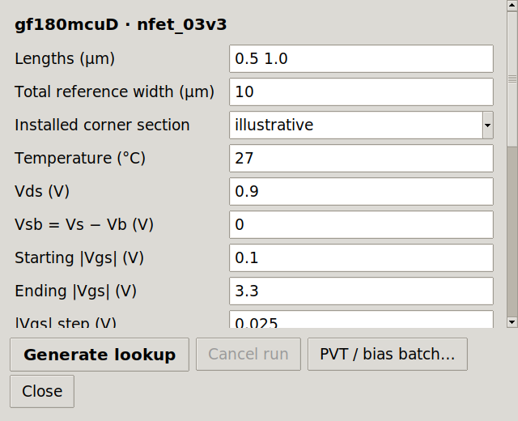
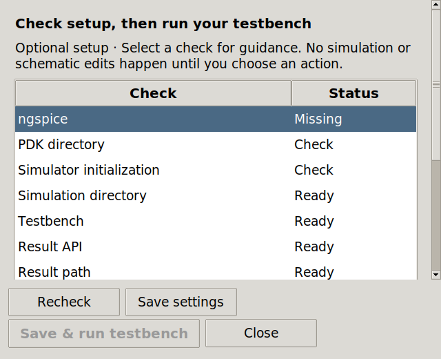
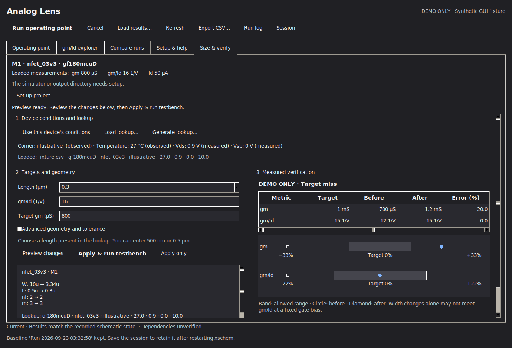

# GUI audit: v0.6.1

This follow-up reviews the complete v0.6 interface against Apple's Human
Interface Guidelines. It applies desktop principles to **IIC-OSIC-TOOLS on
Linux/X11**: clear hierarchy, readable content, predictable controls, keyboard
access, useful feedback, and reversible actions. It does not claim AppKit,
VoiceOver, native macOS, or full Apple accessibility conformance.

## Findings and changes

| Surface | Finding | Change / review result | Guidance |
|---|---|---|---|
| Main toolbar and explorer | Wrapped grid rows shared column widths, wasting space and risking clipping. A reopened window could retain its initial narrow layout. | Independent wrapping rows and layout updates from the actual content frame. | [Layout][layout], [Toolbars][toolbars] |
| All five tabs, menus, sidebar | Existing search, sorting, notebook traversal, numeric alternatives and scoped shortcuts remain useful. | Retained these interactions; added scrolling and focus-driven reveal to the four original tabs so tables, charts and forms remain reachable in short windows. Controls continue to use the host's ttk theme. | [Keyboards][keyboards], [Accessibility][accessibility] |
| Characterization and batch | Large text clipped footer buttons, including Close and preset actions. Long forms and logs competed for height. | Scrollable form content, persistent wrapping action rows, visible log scrollbars, a Close button for batches, and clearer primary actions. | [Layout][layout], [Buttons][buttons] |
| Project setup | The expanding body could push every footer action outside the window. The analysis selector lacked a label. | Footer reserves space; body scrolls; analysis type has a persistent label. | [Layout][layout], [Text fields][fields] |
| Project settings | Long labels could wrap into a narrow column; Apply could disappear below the form. | Full-width explanatory labels, scrollable settings, persistent Apply/Cancel actions. | [Layout][layout] |
| Geometry preview | Four long action titles did not fit small windows. | Wrapping actions, safe initial Cancel focus, explicit primary testbench action. No automatic Apply on Return. | [Buttons][buttons] |
| Secondary windows | New dialogs were inconsistent about ownership, keyboard dismissal and initial focus. | Transient ownership, Escape and Ctrl+W, explicit initial focus and restoration on ordinary close. Closing a characterization view does not cancel its worker. | [Keyboards][keyboards], [Buttons][buttons] |
| Sizing workspace | An empty lookup chooser consumed space, and a delayed selection refresh could clear just-copied conditions. | Label and display the chooser only when several lookups match; synchronize selection before copying conditions. | [Layout][layout], [Text fields][fields] |
| Input help and errors | Characterization displayed sizing instructions because both views shared one help variable. Invalid units did not identify the field. | Separate help state; focus and mark invalid unit fields; explain errors inline and keep entries intact. | [Text fields][fields], [Typography][typography] |
| Verification | Default table rows were cramped; columns and chart labels did not scale with text. Details could be checked in one view but hidden in the other. | Font-based rows and columns, horizontal table scrolling, a scrollable verification dialog, chart font/spacing scaling, synchronized detail disclosure. Numeric values, circle/diamond markers and tolerance outlines remain available without color alone. | [Typography][typography], [Accessibility][accessibility] |
| Project results | No horizontal scrollbar; Open/Details were enabled without a selection; refresh discarded the selection. | Horizontal navigation, selection-dependent actions, preserved selection, and explicit empty-search recovery. | [Lists and tables][tables] |
| Result details | Long provenance had no visible scrollbar or close/copy actions. | Scrollable, selectable details with Copy and Close. | [Layout][layout] |
| Characterization progress | Logs forced readers to the bottom; batch parameters and presets could change while the request ran. | Preserve a scrolled-back reading position, lock request controls while busy, keep Cancel available, and show an indeterminate progress indicator only while running. | [Progress indicators][progress] |
| Contrast and focus | Light/dark presets could fail on a host with different content and frame colors. | Compute local text contrast against each actual surface; use separate content/error text colors, a visible text focus outline, and contrasting chart markers/outlines. Host/global styles remain untouched. | [Accessibility][accessibility], [Contrast evaluation][contrast] |
| Existing utility dialogs and file actions | Lookup data, run log and environment report already have scroll/copy/close interactions; file choosers and warnings are parented. | Reviewed and retained. Existing sizing Undo, stale-result guards and simulation cancellation semantics remain in place. | [Buttons][buttons], [Accessibility][accessibility] |

## Verification and evidence

The seven new GUI regression tests cover:

- All footer actions in seven dialogs at 640×520 with 14-point system text.
- Keyboard focus, automatic form scrolling, inline unit errors and Ctrl+W.
- Scrolling to original-tab content at larger text sizes without ancestor focus events moving the view away.
- Batch request locks, progress visibility and preserved log reading position.
- Result selection preservation, empty-state actions and result-detail scrolling.
- Synchronized verification details and font-based table geometry.
- Separate frame/content contrast and toolbar layout after reopening.

Computed checks require at least 4.5:1 for the tested local body/error text
pairs and 3:1 for chart outlines. These checks do not establish conformance
for every third-party theme, operating-system-rendered state, assistive
technology, or font size. The reviewed large-text size is 14 points; full
200% text enlargement is not claimed. Reopen Analog Lens after changing
the host theme or system font settings.

Final native and real-PDK validation is recorded in [VALIDATION.md](../VALIDATION.md).
The earlier [audit](GUI_AUDIT.md) retains the findings and evidence for v0.2–v0.4.

## Captures

The large-text and dark-theme examples below use explicitly synthetic test
fixtures. They demonstrate actual Tk rendering, not measured PDK results.
The repository's `iic-*.png` screenshots identify real simulator workflows.
The current [real SKY130 workspace](images/iic-hig-workspace.png) and
[completed characterization](images/iic-hig-characterization.png) come from
the passing v0.6.1 IIC run.







Reproduce the complete capture set with Python tkinter, Pillow and X11:

```sh
xvfb-run -a -s '-screen 0 1440x1000x24' python3 tools/capture_gui_audit.py --mode normal --output-dir build/gui-audit/normal
xvfb-run -a -s '-screen 0 1440x1000x24' python3 tools/capture_gui_audit.py --mode large --output-dir build/gui-audit/large
xvfb-run -a -s '-screen 0 1440x1000x24' python3 tools/capture_gui_audit.py --mode dark --output-dir build/gui-audit/dark
```

Each mode covers five tabs, eleven secondary views, a validation error and
an illustrative busy state. Font geometry, text wrapping and keyboard scrolling
were reviewed; automated screenshots do not replace usability testing in a
user's VNC desktop and project.

## Apple sources

Current Apple developer guidance was consulted for this review. Platform-only
visual materials and touch-target measurements were not imposed on Tk desktop
controls. The changes are this project's application of the guidance.

[layout]: https://developer.apple.com/design/human-interface-guidelines/layout
[toolbars]: https://developer.apple.com/design/human-interface-guidelines/toolbars
[buttons]: https://developer.apple.com/design/human-interface-guidelines/buttons
[keyboards]: https://developer.apple.com/design/human-interface-guidelines/keyboards
[accessibility]: https://developer.apple.com/design/human-interface-guidelines/accessibility
[fields]: https://developer.apple.com/design/human-interface-guidelines/text-fields
[typography]: https://developer.apple.com/design/human-interface-guidelines/typography
[tables]: https://developer.apple.com/design/human-interface-guidelines/lists-and-tables
[progress]: https://developer.apple.com/design/human-interface-guidelines/progress-indicators
[contrast]: https://developer.apple.com/help/app-store-connect/manage-app-accessibility/sufficient-contrast-evaluation-criteria
