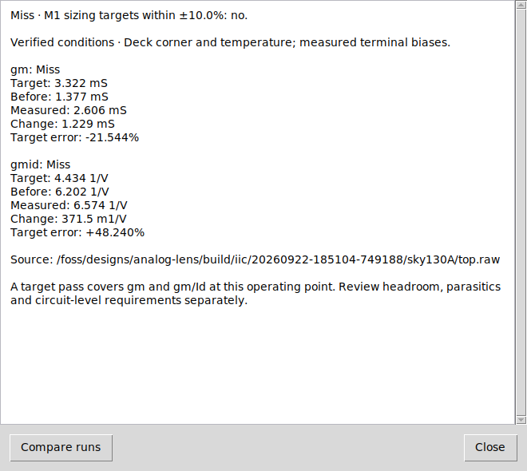
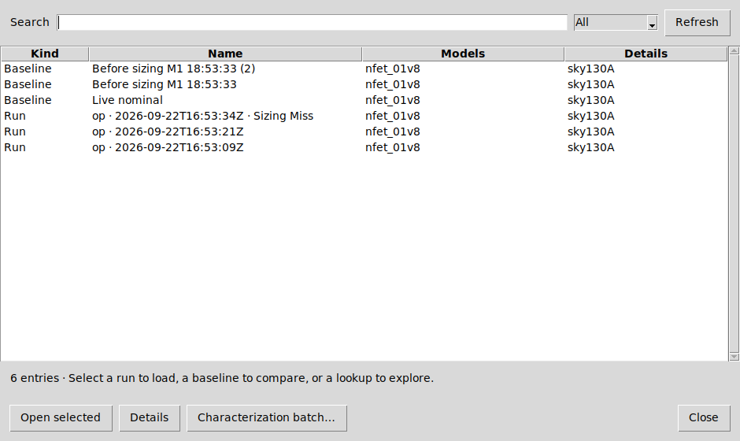
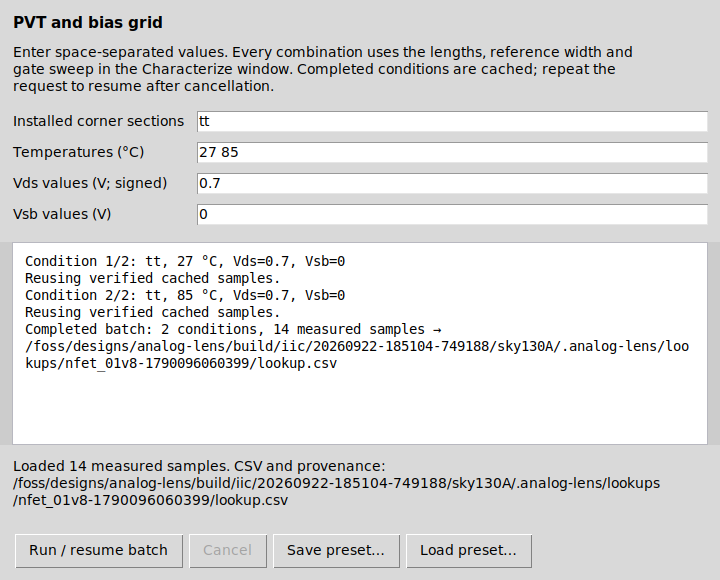

# Integrated design workflow (v0.5)

Analog Lens remains a Tcl/Tk extension inside IIC-OSIC-TOOLS. Open **Project
results** from its xschem menu, inspector sidebar, or analysis window's session
menu. No additional desktop application or service is required.

## Size, run, verify

Select a supported scalar MOS, choose a compatible characterized curve, and set
length, gm/Id and gm. The sizing form now includes finger count, parallel copies
and a target tolerance (10% by default). Blank counts preserve the selected
device's existing literal counts. Preview shows property changes, per-finger
width, realized total width, and operating-condition confidence.

**Apply & run testbench** keeps native simulator controls, including alterations.
**Apply & run OP** performs the existing isolated OP analysis. Both automatically
compare the new measured gm and gm/Id with the requested targets and previous
values. Open **Sizing verification** for measured values, signed changes and
target errors; the previous run is also selected in Compare runs. A result from
a different revision, unchanged raw file, failed/cancelled simulation, or changed
model dependency cannot satisfy the pending verification. DC and transient
results remain inspectable but do not receive an OP target pass.

The target verdict covers gm and gm/Id only. Review headroom, parasitics and
circuit-level specifications separately. The automatic sizing rerun starts at
the top-level testbench; nested edits can be applied locally and use xschem's
normal save/return workflow. One xschem Undo restores the complete geometry edit.



## Geometry conventions

| Family | Dimensions | Finger property | Copy property | Minimum L / finger W (µm) |
|---|---|---|---|---|
| SKY130 1.8 V | W/L in µm | nf | mult | 0.15 / 0.42 |
| GF180 3.3 V | W/L with SI suffix | nf | m | 0.28 / 0.22 |
| IHP low-voltage MOS | w/l with SI suffix | ng | m | 0.13 / 0.15 |

W is width per parallel copy; total effective width is W × copies. Each finger
has width W / fingers. Width rounds up on the supported 5 nm grid, and preview
shows the rounded result. Length must already lie on that grid and be present
in the lookup. The profile guards allow 1–1024 fingers/copies and dimensions up
to 1000 µm; these upper bounds are software limits, not foundry qualification.
Parameterized dimensions are still refused. SKY130's symbol emits both
netlist mult and m from the canonical mult property; an extra instance m
alias is not treated as another intended copy count. Existing parasitic formulas are retained;
fixed extracted parasitics need review after geometry changes.

## Hierarchy without editor navigation

Device-save discovery now reads the generated SPICE netlist and included
subcircuit definitions. It expands repeated hierarchical instances without
descending, selecting objects or changing the displayed sheet. The inspector
queries only the selected owner instead of rescanning every instance on each
poll. Recursive, unresolved or conditional design topology fails explicitly;
the extension does not guess SPICE expression values or branch selection.
The normal xschem netlisting process still follows the host's own policies.

## Provenance and freshness

Each run records SHA-256 fingerprints for its deck, referenced schematic/symbol
paths emitted by xschem, recursively included model files, selected library
sections, and discoverable ngspice initialization/OSDI inputs. A change or
deletion invalidates current results. Fast checks use nanosecond file timestamps
and sizes; full content checks run before accepting sizing verification.

Literal deck temperature and a unique top-level library corner are recorded as
observed conditions. Ambiguous overrides remain unknown. Vds and Vsb confidence
uses measured external terminal voltages. User declarations remain distinguishable
from observed conditions. Missing or unresolved dependency paths are reported as
partial coverage, never silently described as fully verified. Dynamic simulator
scripts and files absent from the generated dependency graph are outside this
coverage. Fingerprints identify inputs; they do not certify a PDK or circuit.

## Project results

The searchable browser lists runs, named baselines and generated lookup CSVs.
Filter by kind or search names, models and condition metadata. Run archives
retain their own raw file, input deck, dependency manifest, measurements and
verification details, so a later native simulation overwriting its raw output
does not destroy history. Loading checks the archive signature and requires its
original schematic/hierarchy. Historical results retain their original freshness
information; they are not relabeled as newly simulated.

History is per testbench under `.analog-lens/history/`; lookup data and cache are
shared within the project directory. Write errors leave loaded results usable
and report that history could not be saved. Run archives can be large; no
automatic deletion policy removes engineering evidence.



## Reusable characterization batches

Open **PVT / bias batch** from Characterize or **Characterization batch** from
Project results. Enter space-separated installed corner sections, temperatures,
signed Vds and Vsb values. Every combination uses the shared lengths, width and
gate sweep. Save/load `.albatch` presets for the same PDK and model. A batch is
limited to 256 condition combinations, with the existing per-sweep bounds.

Completed conditions survive cancellation. Repeat the same request to reuse
them; cache identity includes conditions, model fingerprints, simulator version
and generator source. Modified/incomplete CSVs and unresolved dependency graphs
are not reused. The combined CSV is published only after all conditions succeed.
JSON batch manifests retain job requests, cache identities and completion state.



CLI example (inside IIC):

```sh
python3 tools/batch_characterize.py --pdk sky130A --model nfet_01v8 \
  --lengths 0.5 1 --width 10 --corners tt ss ff --temps 27 85 \
  --vds-values 0.7 0.9 --vsb-values 0 --vgs-start 0.2 \
  --vgs-stop 1.8 --vgs-step 0.05 \
  --cache .analog-lens/cache --output .analog-lens/lookups/pvt/lookup.csv
```

Reference model conventions: [IHP low-voltage model wrapper](https://github.com/IHP-GmbH/IHP-Open-PDK/blob/main/ihp-sg13g2/libs.tech/ngspice/models/sg13g2_moslv_mod.lib),
[SKY130 device details](https://skywater-pdk.readthedocs.io/en/main/rules/device-details.html).
Use the installed IIC model and symbol versions when reproducing results.
