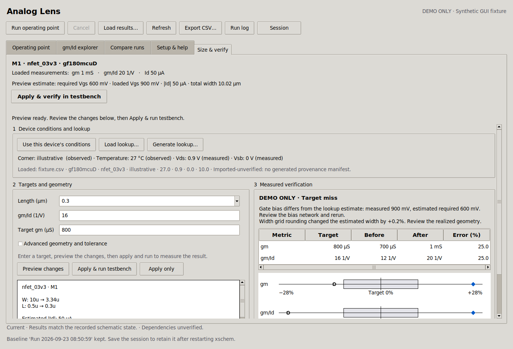

# Bias-aware sizing and lookup trust

These development changes extend the native xschem workflow. Start with the
[runnable SKY130 lessons](../examples/README.md) for a measured walkthrough.



This is an actual Tk capture using explicitly synthetic fixtures, not a PDK
measurement. Reproduce it with `tools/capture_gui_audit.py --mode normal
--output-dir build/guidance-audit` under Xvfb.

## Sizing and verification

The Size & verify workspace has a primary action that follows the current
task: obtain measurements, choose or generate a lookup, preview geometry,
then apply and verify. The global isolated OP action has normal emphasis
while this workspace is selected. Existing keyboard shortcuts remain available.

The preview shows changed properties first; **Show unchanged properties**
reveals the rest. Target fields display six significant digits while their
canonical values retain full precision until the user edits them. Sessions,
interpolation and verification use the canonical values.

Lookups may include `vgs_v`, in signed volts. Generated tables save the external
gate voltage; the MAT converter retains its source VGS coordinate, whose sign
convention must match the imported VDS/VSB coordinates. The estimator linearly
interpolates Vgs on the same monotonic gm/Id branch used for current density.
Existing tables without Vgs still work and show the estimate as unavailable.
No extrapolation or automatic voltage-source editing is introduced.

Preview reports estimated required Vgs, loaded Vgs, estimated current magnitude
and realized width rounding. Verification compares the new measurements with
the lookup conditions and identifies gate-bias differences, drain/body-bias
shifts or appreciable width rounding. When these do not explain a miss, it
directs the designer to width effects, finger geometry and parasitics. These
are diagnostic suggestions, not a proof of causality. Pass still covers only
the two requested device targets.

## Lookup provenance

Generated lookups are checked against their CSV hash, recorded model/source
dependencies and current ngspice version. Batch validation follows every source
lookup. Checks do not execute manifest contents.

| State | Meaning and action |
|---|---|
| Verified | CSV, recorded inputs and simulator version match. |
| Imported-unverified | A CSV has no generated provenance. It remains usable with an explicit notice in preview. |
| Unverified | A generated lookup has incomplete dependency coverage or its simulator cannot be checked. Review the stated limitation before relying on estimates. |
| Outdated | Content, simulator or inputs differ; a required file is missing; or provenance is invalid. Regenerate before applying geometry. |

Outdated generated lookups are excluded from saved-lookup matching and blocked
at preview and Apply. Apply rechecks provenance and rejects a CSV changed since
loading, including changes between preview and Apply. Imported CSV metadata
does not establish verification. Moving generated data without its recorded
inputs can make it outdated; regenerate in the destination project.

## Responsiveness and state

The UI uses explicit freshness and attachment states rather than interpreting
message text. Routine provenance checks run in a short-lived background process
and return through Tcl file events. In-flight checks are reused and obsolete
responses cannot replace newer state. User-triggered preview/Apply checks are
fresh, synchronous validation gates.

Lookup slices and lengths are indexed once when the loaded table changes.
Workspace widgets are updated when their input state changes. Reproduce the
focused index benchmark with:

```sh
python3 tools/profile_lookup.py --samples 100000
```

A local Tcl 8.6.14 run measured 25.6 ms per full scan, 93.8 ms to build the
index, and 0.0011 ms per cached read for 100,000 synthetic rows. This measures
index access, not complete application latency or an IIC performance guarantee.

## Validation workflow

Local validation on 2026-09-23: **142 tests passed without skips** using
Python 3.12 and Tcl/Tk 8.6.14 under Xvfb; the native Tk smoke test passed too.
The full GUI capture script completed and the workspace/preview were visually
reviewed. Python compilation and shell syntax checks passed. The IIC tools and
PDKs were unavailable locally, so the expanded real-PDK checks are pending.

PRs run native GUI tests and focused SKY130 integration. The integration job
exercises NMOS plus a PMOS GUI sizing flow at an installed nonnominal corner,
85 °C and Vsb = −0.1 V; measured exports are compared with raw simulator values.
It also runs the generated sizing lesson and verifies its adjusted result.
Main-branch pushes, weekly runs and manual runs cover all supported PDKs.

```sh
bash tools/run_iic_container.sh --pdks sky130A
bash tools/run_iic_container.sh
```

The workflow configuration creates checks; repository branch-protection
settings decide whether they are required for merging. This change does not
change those settings. Historical v0.6.1 evidence in VALIDATION.md does not
validate these new features; the new integration run must pass before release.
